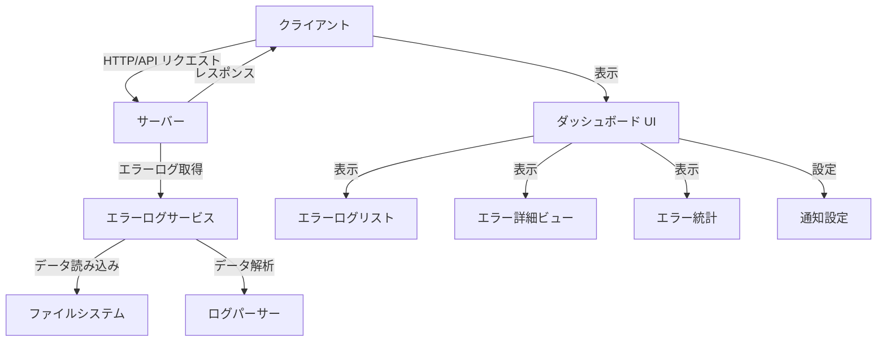

# エラーログダッシュボード設計ドキュメント

## 概要

エラーログダッシュボードは、システム内で発生したエラーを効率的に監視、分析、対応するためのインターフェースを提供します。このダッシュボードは、既存のアプリケーションに統合され、エラーログの表示、フィルタリング、詳細表示、統計情報の可視化、通知設定などの機能を提供します。

## アーキテクチャ

エラーログダッシュボードは、既存のアプリケーションアーキテクチャに統合されます。主要なコンポーネントは以下の通りです：



### クライアントサイド

1. **React コンポーネント**
   - ErrorDashboard: メインダッシュボードコンポーネント
   - ErrorLogTable: エラーログの一覧表示
   - ErrorLogViewer: 特定のエラーログの詳細表示
   - ErrorStatsChart: エラー統計のグラフ表示
   - ErrorFilterPanel: フィルタリングインターフェース
   - NotificationSettings: 通知設定インターフェース

2. **状態管理**
   - React の useState と useEffect フックを使用
   - カスタムフック（useErrorLogs）を作成してエラーログデータの取得と管理

### サーバーサイド

1. **API エンドポイント**
   - `/api/v2/errors`: エラーログの取得
   - `/api/v2/errors/stats`: エラー統計情報の取得
   - `/api/v2/errors/:id`: 特定のエラーログの詳細取得
   - `/api/v2/errors/notifications`: 通知設定の取得・更新

2. **サービス**
   - ErrorLogService: エラーログの読み取り、解析、フィルタリング
   - NotificationService: 通知条件の評価と通知の送信

## コンポーネントとインターフェース

### 1. ErrorLogService

```typescript
// src/services/errorLogService.ts
import { ErrorLog, ErrorStats, ErrorFilter } from '../types';

export interface ErrorLogService {
  getErrorLogs(filter?: ErrorFilter): Promise<ErrorLog[]>;
  getErrorById(id: string): Promise<ErrorLog | null>;
  getErrorStats(filter?: ErrorFilter): Promise<ErrorStats>;
  getSimilarErrors(errorId: string): Promise<ErrorLog[]>;
}

export class FileSystemErrorLogService implements ErrorLogService {
  // 実装
}
```

### 2. ErrorDashboard コンポーネント

```typescript
// src/components/ErrorDashboard.tsx
import React from 'react';
import { ErrorLog, ErrorFilter, ErrorStats } from '../types';
import ErrorLogTable from './ErrorLogTable';
import ErrorStatsChart from './ErrorStatsChart';
import ErrorFilterPanel from './ErrorFilterPanel';

interface ErrorDashboardProps {
  // プロパティ
}

const ErrorDashboard: React.FC<ErrorDashboardProps> = (props) => {
  // 実装
};
```

### 3. ErrorLogTable コンポーネント

```typescript
// src/components/ErrorLogTable.tsx
import React from 'react';
import { ErrorLog } from '../types';
import { TableColumn } from '../components/DataTable';

interface ErrorLogTableProps {
  errors: ErrorLog[];
  onErrorSelect: (error: ErrorLog) => void;
  loading?: boolean;
}

const ErrorLogTable: React.FC<ErrorLogTableProps> = (props) => {
  // 実装
};
```

### 4. ErrorLogViewer コンポーネント

```typescript
// src/components/ErrorLogViewer.tsx
import React from 'react';
import { ErrorLog } from '../types';

interface ErrorLogViewerProps {
  error: ErrorLog | null;
  onClose: () => void;
  similarErrors?: ErrorLog[];
}

const ErrorLogViewer: React.FC<ErrorLogViewerProps> = (props) => {
  // 実装
};
```

### 5. NotificationSettings コンポーネント

```typescript
// src/components/NotificationSettings.tsx
import React from 'react';
import { NotificationRule } from '../types';

interface NotificationSettingsProps {
  rules: NotificationRule[];
  onRuleAdd: (rule: NotificationRule) => void;
  onRuleUpdate: (id: string, rule: NotificationRule) => void;
  onRuleDelete: (id: string) => void;
}

const NotificationSettings: React.FC<NotificationSettingsProps> = (props) => {
  // 実装
};
```

## データモデル

### 1. ErrorLog

```typescript
// src/types/index.ts に追加
export interface ErrorLog {
  id: string;
  timestamp: Date;
  level: 'ERROR' | 'WARNING' | 'CRITICAL' | 'INFO';
  message: string;
  code?: string;
  stackTrace?: string;
  source?: string;
  context?: Record<string, any>;
  userId?: string;
  sessionId?: string;
  requestInfo?: {
    method?: string;
    url?: string;
    headers?: Record<string, string>;
    body?: any;
  };
  resolved?: boolean;
  resolvedAt?: Date;
  resolvedBy?: string;
  notes?: string;
}
```

### 2. ErrorFilter

```typescript
// src/types/index.ts に追加
export interface ErrorFilter {
  startDate?: Date;
  endDate?: Date;
  levels?: ('ERROR' | 'WARNING' | 'CRITICAL' | 'INFO')[];
  sources?: string[];
  errorCodes?: string[];
  search?: string;
  resolved?: boolean;
  userId?: string;
  sessionId?: string;
  limit?: number;
  offset?: number;
}
```

### 3. ErrorStats

```typescript
// src/types/index.ts に追加
export interface ErrorStats {
  totalErrors: number;
  errorsByLevel: Record<string, number>;
  errorsBySource: Record<string, number>;
  errorsByCode: Record<string, number>;
  errorsByTime: {
    timestamp: Date;
    count: number;
  }[];
  topErrors: {
    code: string;
    message: string;
    count: number;
  }[];
}
```

### 4. NotificationRule

```typescript
// src/types/index.ts に追加
export interface NotificationRule {
  id: string;
  name: string;
  conditions: {
    levels?: ('ERROR' | 'WARNING' | 'CRITICAL' | 'INFO')[];
    sources?: string[];
    errorCodes?: string[];
    frequency?: {
      count: number;
      timeWindow: number; // ミリ秒
    };
  };
  actions: {
    type: 'EMAIL' | 'SYSTEM_NOTIFICATION' | 'WEBHOOK';
    config: Record<string, any>;
  }[];
  enabled: boolean;
  createdAt: Date;
  updatedAt: Date;
}
```

## エラー処理

エラーログダッシュボード自体のエラー処理は、既存のエラーハンドリングメカニズムを活用します：

1. **クライアントサイドエラー処理**
   - API リクエストエラーの処理とユーザーへの表示
   - データ解析エラーの処理
   - UI コンポーネントのエラー境界の実装

2. **サーバーサイドエラー処理**
   - エラーログファイルの読み取りエラーの処理
   - API エンドポイントでのエラーハンドリング
   - 通知送信失敗時の処理

## テスト戦略

1. **ユニットテスト**
   - ErrorLogService のテスト
   - 各 React コンポーネントのテスト
   - データ変換・フィルタリングロジックのテスト

2. **統合テスト**
   - API エンドポイントのテスト
   - コンポーネント間の相互作用のテスト

3. **エンドツーエンドテスト**
   - ユーザーフローのテスト（エラーログの表示、フィルタリング、詳細表示など）

## UI デザイン

### エラーログダッシュボードのレイアウト

```
+-----------------------------------------------------------------------+
| エラーログダッシュボード                                   [更新] [設定] |
+-----------------------------------------------------------------------+
|                                                                       |
| [統計情報]                                                             |
| +-------------------+ +-------------------+ +-------------------+      |
| | 総エラー数         | | 重要度別分布       | | 発生源別分布       |      |
| | 123               | | [円グラフ]         | | [円グラフ]         |      |
| +-------------------+ +-------------------+ +-------------------+      |
|                                                                       |
| [エラー発生トレンド]                                                    |
| +-------------------------------------------------------------------+ |
| |                                                                   | |
| | [折れ線グラフ - 時間経過に伴うエラー数]                              | |
| |                                                                   | |
| +-------------------------------------------------------------------+ |
|                                                                       |
| [フィルター] 重要度: [  ] 期間: [  ] エラーコード: [  ] 発生源: [  ]     |
|                                                                       |
| [エラーログ一覧]                                                       |
| +-------------------------------------------------------------------+ |
| | 時間        | 重要度 | コード   | メッセージ           | 発生源      | |
| |------------|--------|---------|---------------------|------------| |
| | 2023-07-17 | ERROR  | E1001   | Database connection | api-server | |
| | 2023-07-17 | WARN   | W2001   | Memory usage high   | app-server | |
| | ...        | ...    | ...     | ...                 | ...        | |
| +-------------------------------------------------------------------+ |
|                                                                       |
+-----------------------------------------------------------------------+
```

### エラー詳細ビュー

```
+-----------------------------------------------------------------------+
| エラー詳細                                                    [閉じる] |
+-----------------------------------------------------------------------+
| 時間: 2023-07-17 13:45:22                                             |
| 重要度: ERROR                                                         |
| コード: E1001                                                         |
| メッセージ: Database connection failed                                 |
| 発生源: api-server                                                    |
|                                                                       |
| [コンテキスト情報]                                                     |
| +-------------------------------------------------------------------+ |
| | {                                                                 | |
| |   "userId": "user-123",                                           | |
| |   "sessionId": "sess-456",                                        | |
| |   "database": "main-db",                                          | |
| |   "operation": "query"                                            | |
| | }                                                                 | |
| +-------------------------------------------------------------------+ |
|                                                                       |
| [スタックトレース]                                                     |
| +-------------------------------------------------------------------+ |
| | Error: Database connection failed                                  | |
| |   at connectToDatabase (/app/src/services/db.js:45:7)             | |
| |   at processRequest (/app/src/controllers/api.js:23:12)           | |
| |   at handleRequest (/app/src/routes/api.js:67:10)                 | |
| |   ...                                                             | |
| +-------------------------------------------------------------------+ |
|                                                                       |
| [リクエスト情報]                                                       |
| +-------------------------------------------------------------------+ |
| | Method: GET                                                       | |
| | URL: /api/v2/users/profile                                        | |
| | Headers: {                                                        | |
| |   "authorization": "Bearer [redacted]",                           | |
| |   "content-type": "application/json"                              | |
| | }                                                                 | |
| +-------------------------------------------------------------------+ |
|                                                                       |
| [類似エラー]                                                          |
| +-------------------------------------------------------------------+ |
| | - 2023-07-16 22:13:45 - Database connection failed (E1001)        | |
| | - 2023-07-15 14:22:33 - Database connection failed (E1001)        | |
| +-------------------------------------------------------------------+ |
|                                                                       |
| [アクション]                                                          |
| [解決済みとしてマーク] [メモを追加] [通知ルールを作成]                   |
|                                                                       |
+-----------------------------------------------------------------------+
```

### 通知設定画面

```
+-----------------------------------------------------------------------+
| 通知設定                                                     [保存]    |
+-----------------------------------------------------------------------+
| [通知ルール一覧]                                                       |
| +-------------------------------------------------------------------+ |
| | 名前         | 条件                      | アクション    | 有効/無効  | |
| |-------------|---------------------------|--------------|----------| |
| | 重大エラー通知 | 重要度: CRITICAL          | メール        | 有効      | |
| | DB エラー通知 | コード: E1001, E1002      | システム通知   | 有効      | |
| | ...         | ...                       | ...          | ...      | |
| +-------------------------------------------------------------------+ |
|                                                                       |
| [新規ルール追加]                                                       |
| +-------------------------------------------------------------------+ |
| | 名前: [                    ]                                       | |
| |                                                                   | |
| | 条件:                                                             | |
| | 重要度: [ ] ERROR [ ] WARNING [ ] CRITICAL [ ] INFO               | |
| | エラーコード: [                    ]                               | |
| | 発生源: [                    ]                                     | |
| | 頻度: [    ] 回 / [    ] 分                                       | |
| |                                                                   | |
| | アクション:                                                        | |
| | [ ] メール送信: [                    ]                             | |
| | [ ] システム通知                                                   | |
| | [ ] Webhook URL: [                    ]                           | |
| |                                                                   | |
| | [追加]                                                            | |
| +-------------------------------------------------------------------+ |
|                                                                       |
+-----------------------------------------------------------------------+
```

## 実装計画

1. **データモデルの実装**
   - 型定義の追加
   - エラーログサービスの実装

2. **API エンドポイントの実装**
   - エラーログ取得 API
   - エラー統計 API
   - 通知設定 API

3. **UI コンポーネントの実装**
   - エラーログテーブル
   - エラー詳細ビュー
   - 統計グラフ
   - フィルターパネル
   - 通知設定画面

4. **統合とテスト**
   - コンポーネントの統合
   - エンドツーエンドテスト
   - パフォーマンス最適化

## セキュリティ考慮事項

1. **アクセス制御**
   - エラーログへのアクセスは認証されたユーザーのみに制限
   - 役割ベースのアクセス制御（管理者のみがすべてのエラーログにアクセス可能）

2. **データ保護**
   - 機密情報（個人情報、認証情報など）の自動的な編集
   - エラーログの保存期間ポリシーの実装

3. **入力検証**
   - すべてのユーザー入力（フィルター、検索クエリなど）の検証
   - SQLインジェクションやXSSなどの攻撃からの保護

## パフォーマンス考慮事項

1. **データ読み込みの最適化**
   - ページネーションの実装
   - 必要なデータのみを取得する効率的なクエリ

2. **UI パフォーマンス**
   - 大量のエラーログの効率的なレンダリング
   - 仮想スクロールの実装

3. **キャッシング**
   - 頻繁にアクセスされるエラー統計のキャッシング
   - API レスポンスのキャッシング